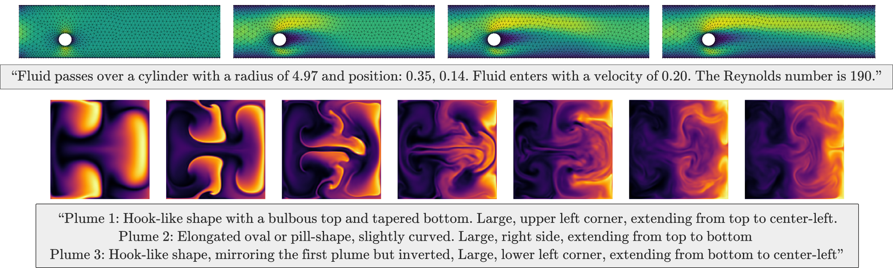

# Text2PDE: Latent Diffusion Models for Accessible Physics Simulation
Official implementation of Latent Diffusion Models for Accessible Physics Simulation. [(Paper)](https://arxiv.org/abs/2410.01153)



## Requirements

To install requirements:
```
conda-env create -n my_env -f=environment.yml
```

Alternatively, to manually install required packages:
```setup
conda create -n "my_env" 
conda install pytorch==2.0.0 torchvision==0.15.0 torchaudio==2.0.0 pytorch-cuda=11.8 torchdata=0.6.0 -c pytorch -c nvidia 
conda install pytorch-scatter -c pyg
conda install lightning -c conda-forge
pip install transformers 
pip install wandb h5py tensorboard einops open3d sparse-dot-mkl timm 
```
Some packages are just easier to install with pip vs conda.

Optional installs for image captioning, FLOPs profiling, and text evaluation:
```
pip install scikit-image deepspeed phiflow
```

If you cannot install pytorch<=2.0.1, please refer to the [Compatibility](#compatibility) section, as some libraries require this version. 

## Datasets
Full datasets are available [here.](https://huggingface.co/datasets/ayz2/ldm_pdes)

Please refer to the [dataset](dataset) directory for a description of the raw data and dataloading. 

## Pretrained Models
Pretrained models are available [here.](https://huggingface.co/datasets/ayz2/ldm_pdes)

The pretrained models are:
```
- Autoencoders:
    - ae_cylinder.ckpt : autoencoder trained to compress cylinder mesh data across 25 timesteps. Does not use GAN or LPIPS.
    - ae_ns2D.ckpt: autoencoder trained to compress smoke buoyancy data (48x128x128). Does not use GAN or LPIPS.
- LDMs:
    - cylinder flow
        - ldm_DiT_FF_cylinder.ckpt: ldm model trained to sample a cylinder flow solution conditioned on the first frame
        - ldm_DiTSmall_FF_cylinder.ckpt: same as previous, just smaller DiT size.
        - ldm_DiT_text_cylinder.ckpt: ldm model trained to sample a cylinder flow solution conditioned on a text prompt
        - ldm_DiTSmall_text_cylinder.ckpt: same as previous, just smaller DiT size.
    - ns2D
        - ldm_DiT_FF_ns2D.ckpt: ldm model trained to sample a smoke buoyancy solution conditioned on the first frame
        - ldm_DiTSmall_FF_ns2D.ckpt: same as previous, just smaller DiT size.
        - ldm_DiTLarge_FF_ns2D.ckpt: same as previous, just large DiT size.
        - ldm_DiT_text_ns2D.ckpt: ldm model trained to sample a smoke buoyancy solution conditioned on a text prompt
        - ldm_DiTSmall_text_ns2D.ckpt: same as previous, just smaller DiT size.
        - ldm_DiTLarge_text_ns2D.ckpt: same as previous, just large DiT size.
```

## Training and Inference
For more information about the relevant training parameters, see the [configs](configs) directory.

Workflow for training a model:
```
- Setup environment
- Download a dataset 
- Make a log directory 
- Setup wandb
- Set paths to dataset, normalization stats, logging directory
- For LDM training: download a pretrained AE or train an AE
- Recommended training hardware:
    - LDM_small: 1xA100
    - LDM_medium: 4xA100
    - LDM_large: 4xA100 80GB
```

Workflow for inference:
```
- Download a pretrained LDM and AE model
- For text evaluation/FLOPs: setup PhiFlow/Deepspeed
- Set paths to pretrained model and logging directory
- Approximate memory requirements for inference w/ batch size = 1:
    - LDM_small: 6.7 GB
    - LDM_medium: 12.5 GB
    - LDM_large: 35 GB
```

### Autoencoder
To train an autoencoder (supports KL regularization, GAN, LPIPS):
```
python train_AE.py --config=path/to/config
```

Example: train an autoencoder for the cylinder dataset without GAN or LPIPS
```
python train_AE.py --config=configs/cylinder/ae/ae_mesh.yaml
```

### Latent Diffusion Model
To train a latent diffusion model:
```
python train_ldm.py --config=path/to/config
```

Example: train a small-size LDM for the NS2D dataset with text conditioning
```
python train_ldm.py --config=configs/ns2D/ldm/text/ldm_DiTSmall_text.yaml
```

### Baselines
To train a baseline model for the cylinder flow problem:
```
python train_{gino/gnn/oformer}.py --config=path/to/config 
```
To train a baseline model for the smoke buoyancy (ns2D) problem:
```
python train_{ns2D/acdm}.py --config=path/to/config
```
Note that the FNO, Unet, and Resnet models all use the same script (train_ns2D.py).
Example: train a FNO baseline on the NS2D dataset
```
python train_ns2D.py --config=configs/ns2D/baselines/fno.yaml
```

### Validation/Inference
To generate reconstructed samples on the validation set and evaluate a mean reconstruction loss on cuda:0:
```
python validate_AE.py --config=path/to/config --device="cuda:0"
```

For baselines (not including ACDM), to generate predicted samples on the validation set and evaluate a mean prediction loss:
```
python validate_{cylinder/ns2D}.py --config=path/to/config
```

For LDM and ACDM models, to conditionally sample from the validation set and evaluate and mean prediction loss:
```
python validate_ldm.py --config=path/to/config
```

Example: sample a pretrained medium-size LDM by conditioning on first-frames in a cylinder validation set.
```
python validate_ldm.py --config=configs/cylinder/ldm/text/ldm_DiT_text.yaml
```

### FLOPs profiling

Configs passed to validation scripts can also be used to generate a corresponding FLOPs profile: 
```
python profile_flops.py --config=path/to/config
```

Example: Profile FLOPs of large LDM model on NS2D with text conditioning:
```
python profile_flops.py --config=configs/ns2D/ldm/text/ldm_FiTLarge_text.yaml
```

## Text Captioning
Scripts for captioning PDE simulations are in the [text](text) directory, along with some details.

## Compatibility
Some parts of the code relies on [Open3D](https://www.open3d.org/). Specifically, Open3D requires a version of torch <=2.0.1; this option can be disabled in the config files if the installation is not compatible, and the codebase can fall back to a native PyTorch implementation. This is slower and requires more memory, but can be set with the flag use_open3d=False in all configs.

Additionally, there are certain reports of FFT failing for pytorch-cuda <=11.7 ([issue](https://github.com/pytorch/pytorch/issues/88038)). Only the FNO and GINO baselines make use of FFT.

Lastly, the smoke buoyancy problem relies on the torchdata and datapipes [package](https://github.com/pytorch/data), which will be deprecated in the future. This may also cause compatibility issues with newer versions of torch (>=2.0.1), specifically:

```
File "/home/anaconda3/envs/env-name/lib/python3.11/site-packages/torchdata/datapipes/iter/util/cacheholder.py", line 24, in <module>
    from torch.utils._import_utils import dill_available
ModuleNotFoundError: No module named 'torch.utils._import_utils'
```

A workaround is to define a function to always return false:

```
cd /path-to-conda-env/lib/python3.11/site-packages/torch/utils
echo "def dill_available(): return False" > _import_utils.py
```

## SLURM Users
For those leveraging multiprocessing on a SLURM cluster, there are some additional considerations:
- If you plan on training the model with text capabilities, it is recommended to manually download the pretrained LLM weights (RoBERTa) and load them [locally](https://stackoverflow.com/questions/64001128/load-a-pre-trained-model-from-disk-with-huggingface-transformers), as downloading weights on the fly may cause the script to hang. RoBERTa weights can be found [here](https://huggingface.co/FacebookAI/roberta-base/tree/main). 

```
# On the fly. Might cause the script to hang.
tokenizer = AutoTokenizer.from_pretrained("FacebookAI/roberta-base") 
model = RobertaModel.from_pretrained("FacebookAI/roberta-base")

 # Loading weights locally. Safer option.
tokenizer = AutoTokenizer.from_pretrained(cache_path, local_files_only=True)
model = RobertaModel.from_pretrained(cache_path, local_files_only=True)
```

- You may need to limit the number of train/val batches per epoch if using datapipes. In some DDP cases, having incomplete batches can cause GPUs to hang. [Issue](https://github.com/Lightning-AI/pytorch-lightning/issues/11910)
